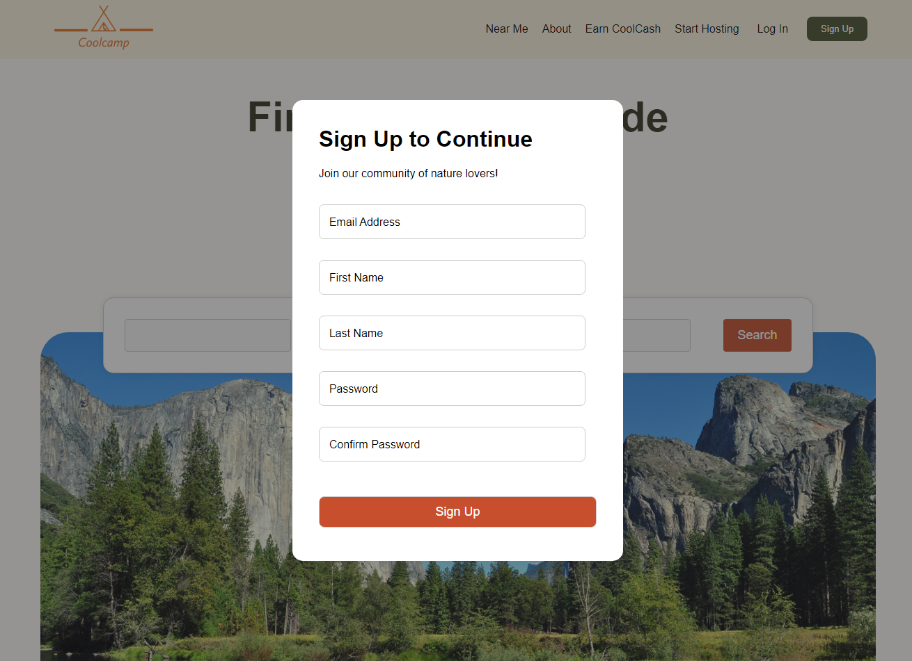
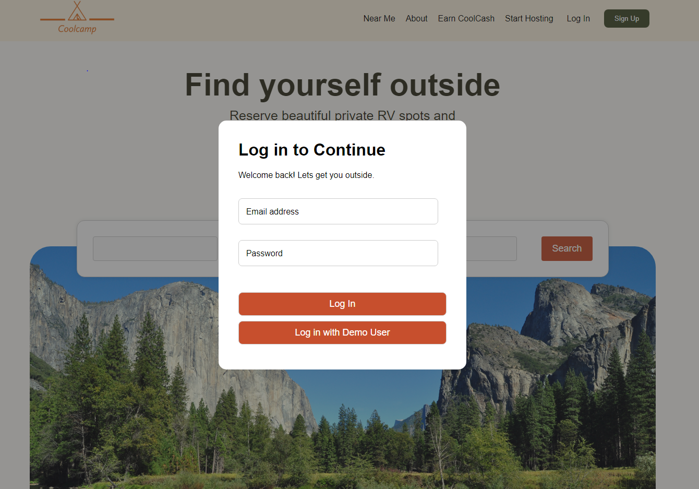
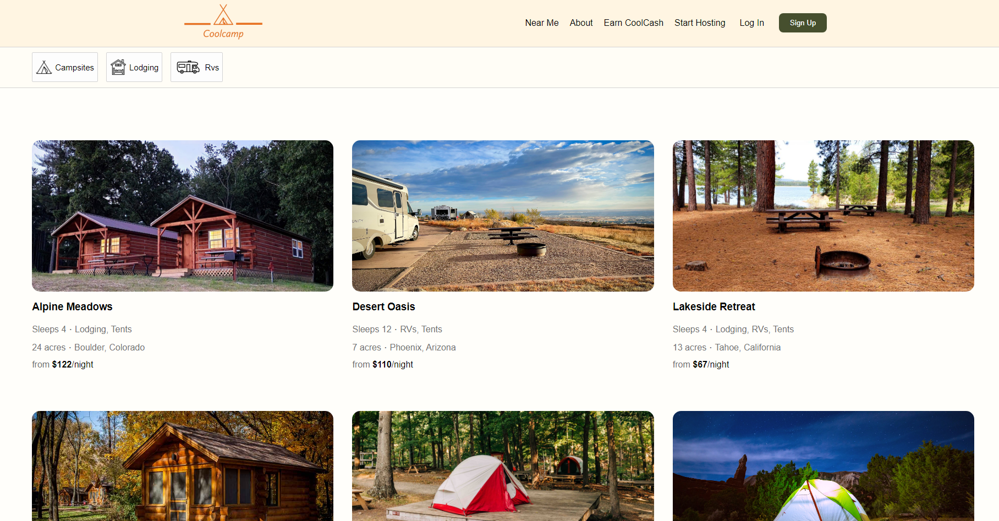
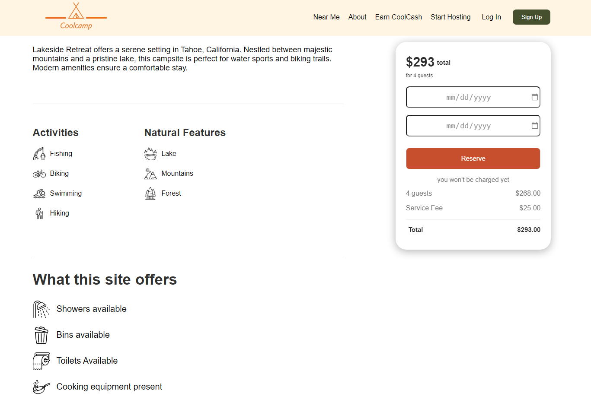
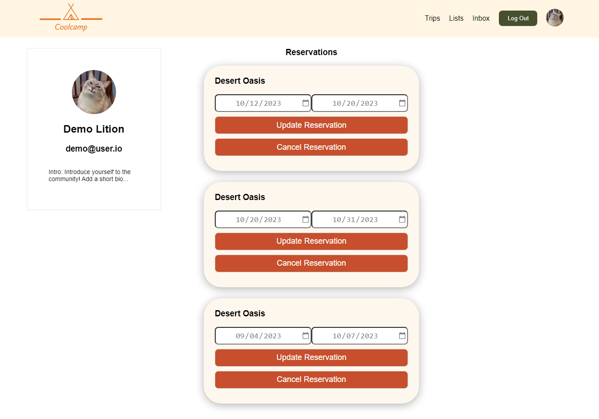
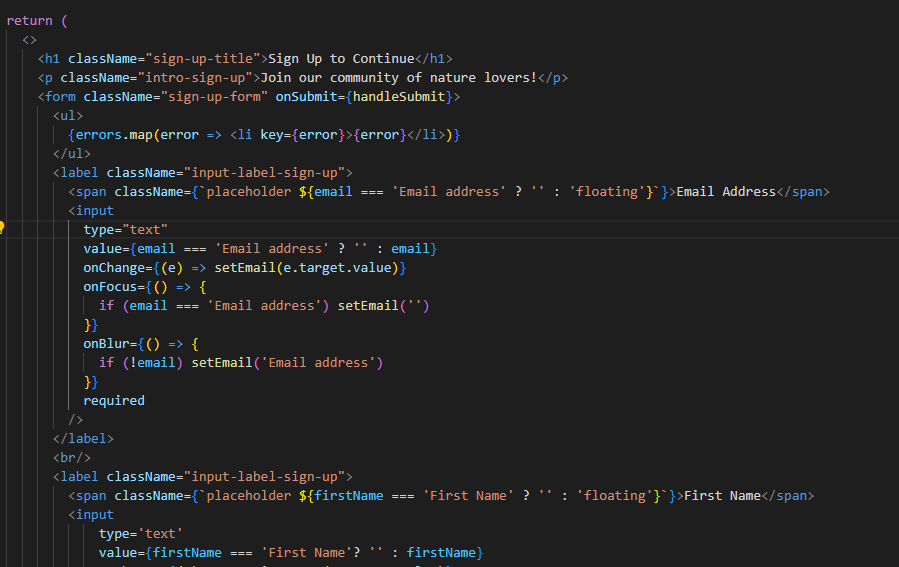
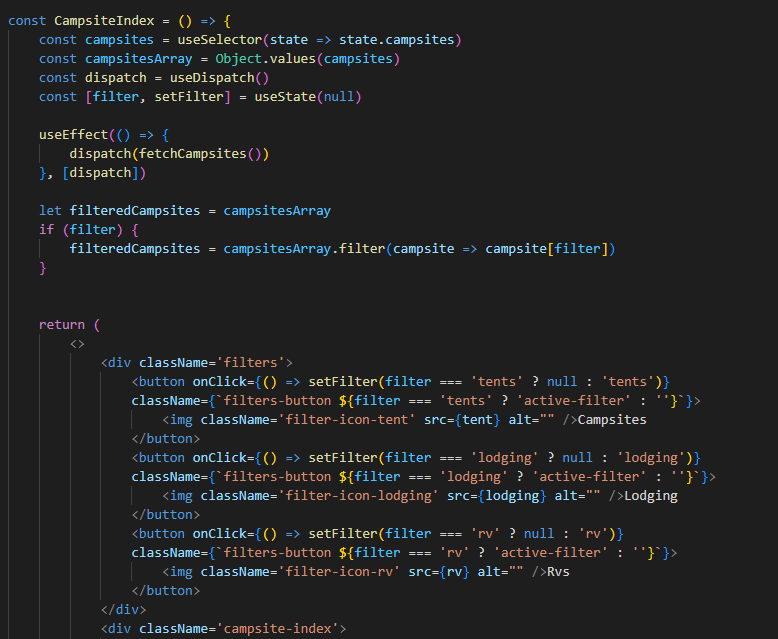

# Welcome to Coolcamp

CoolCamp is a HipCamp clone where users can explore and reserve different camp sights, RV sights, cabins and etc. from across the country. These users who could also hosts these site can leave reviews for the sites as well as reviews for those who reserved those sites.

# Technologies

### Frontend

* `JavaScript` - as the main laguage for the fronend
* `React` - a JavaScript library used for building the user interface
* `Redux` - used with React to handle application state

### Backend

* `Rails` - a server side web aplication framework written in Ruby
* `BCrypt` - a library used to hash password 
* `PostgreSQL` - a relational database management system
* `AWS S3` - an Amazon cloud service used for storing images

# Features

1. Users can sign up and sign into an account to use other features of the application
2. Users are able to browse through an index of campsites and click on them to view futher details in their showpage. Users can also filter campsites based on if the campsite includes lodging, RV spots or tenting locations.
3. Users can reserve a campsite for the days of their choice and will be able to view their reservations on their profile page
4. Users can then update their reservations to change their dates or delete them entirely in their user profile page

### Log in/ Sign up

Users are able to create new accounts which will have their passwords be hashed using BCrypt and stored as a password digest and then ran through BCrypt again when they try to log in.

----------

----------

### Campsites Index

Users are able to browse through a seleciton of campsites and view minor details in order to determine which seems the most appealing to them. Details on the index page include the number of people the site can sleep, the amount of acres a site covers, the location, the price and if it includes either lodging, tenting or RV spots. Users may also filter campsites based on if they include or don't include lodging, tenting or RV spots.

--------

### Campsite Show Page

Users can select any campsite to view additional details such as a description of the campsite, the activities around the campsite, the natural features around the campsite and the ammentities the site has to offer. They may then select their appropriate dates to reserve their campsite.

------

### User Profile

Users may then go to their profile to edit any of their exisiting reservations by changing their reservation dates or delete the reservation entirely if they are unsatisfied with it or change their mind. 

-------

# Technical Implementations

### Log in / Sign up

One CSS styling implementaiton im proud of was a simple feature that allowed the placeholder of the input fields to shift to the top of the input field when a user clicked on it. This was done with a number of ternery statements which checked to see if the useState variable for that input field was empty or had a default value. All input fields have a span which are translated to the position of the input field and which have a classname that changes based on what the value of the useState is. As they all start with a default value, the classname had add-ons to it. Once the user clicks on an input field, the value of the useState changes to black which when adds the classname of 'floating' to the span. This translates the span back to its original position above the input field. 

--------

### Campsites Filter

Another simple feature was the filter implementaiton which took the array of campsites and filtered them based on if they include certain sleeping ammenities. As the campsites have a boolean field which determines if they have lodging, tents or RV spots, all that needed to be done was check to see if the campsite returned true for that field and only display those. Using ternary operators, I was able to make the buttons dynamic to remove the filter if the user reclicked the filter option. 

# Future Features

1. Search feature to search campsites
2. Google Maps API to display campsites that are searched in the index on a map in a given region 
3. Review feature for each campsite
4. Favoriting a Campsite